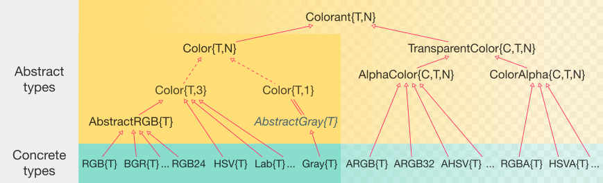

# ColorTypes

[](https://travis-ci.org/JuliaGraphics/ColorTypes.jl)
[](http://codecov.io/github/JuliaGraphics/ColorTypes.jl?branch=master)

This "minimalistic" package serves as the foundation for working with
colors in Julia.  It defines basic color types and their constructors,
and sets up traits and `show` methods to make them easier to work
with.

Of related interest is the [Colors.jl](https://github.com/JuliaGraphics/Colors.jl) package, which provides
"colorimetry" and conversion functions for working with colors.  You
may also be interested in the [ColorVectorSpace.jl](https://github.com/JuliaGraphics/ColorVectorSpace.jl) package, which
defines mathematical operations for certain color types.  Both of
these packages are based on ColorTypes, which ensures that any color
objects will be broadly usable.

# Types available in ColorTypes

## The type hierarchy and abstract types

Here is the type hierarchy used in ColorTypes:



- `Colorant` is the general term used for any object exported by this
  package.  True colors are called `Color`; `TransparentColor`
  indicates an object that also has alpha-channel information.

- `Color{T,3}` is a 3-component color (like RGB = red, green, blue);
  `Color{T,1}` is a 1-component color, i.e., grayscale).

- Most colors have both `AlphaColor` and `ColorAlpha` variants;
  for example, `RGB` has both `ARGB` and `RGBA`.  These indicate
  different underlying storage in memory: `AlphaColor` stores the
  alpha-channel first, then the color, whereas `ColorAlpha` stores the
  color first, then the alpha-channel.  Storage order can be
  particularly important for interfacing with certain external
  libraries (e.g., OpenGL and Cairo).

## Colors

### RGB plus BGR, RGB1, RGB4, and RGB24: the AbstractRGB group

The [sRGB colorspace](https://en.wikipedia.org/wiki/SRGB).

```jl
immutable RGB{T} <: AbstractRGB{T}
    r::T # Red in [0,1]
    g::T # Green in [0,1]
    b::T # Blue in [0,1]
end
```

RGBs may be defined with two broad number types: `FloatingPoint` and
`FixedPoint`.  `FixedPoint` come from the
[`FixedPointNumbers`](https://github.com/JeffBezanson/FixedPointNumbers.jl)
package, and represent fractional numbers (between 0 and 1, inclusive)
internally using integers.  For example, `0xffuf8` creates a `Ufixed8`
(`U8` for short) number with value equal to `1.0` but which internally
is represented as `0xff`.  This strategy ensures that `1` always means
"saturated color", regardless of how that value is represented.
Ordinary integers should not be used, although the convenience
constructor `RGB(1,0,0)` will create a value `RGB{U8}(1.0, 0.0, 0.0)`.

The analogous `BGR` type is defined as

```jl
immutable BGR{T} <: AbstractRGB{T}
    b::T
    g::T
    r::T
end
```

i.e., identical to `RGB` except in the opposite storage order.  One
crucial point: **for all `AbstractRGB` types, the constructor
accepts values in the order `(r,g,b)` regardless of how they
are arranged internally in memory**.

`RGB1` and `RGB4` seem exactly like `RGB`, but internally they insert
one extra ("invisible") padding element; when the element type is
`U8`, these have favorable memory alignment for interfacing with
libraries like OpenGL.

Finally, one may represent an RGB color as 8-bit values packed into a
32-bit integer:

```julia
struct RGB24 <: AbstractRGB{U8}
    color::UInt32
end
```

The storage order is `0xAARRGGBB`, where `RR` means the red channel,
`GG` means the green, and `BB` means the blue.  `AA` is ignored for
`RGB24`; there is also an `ARGB32`, for which that byte represents
alpha. Note that this type can also be constructed as
`RGB24(0.8,0.5,0.2)`. However, since this type has no fields named
`r`, `g`, `b`, it is better to extract values from `AbstractRGB`
objects using `red(c)`, `green(c)`, `blue(c)`.


### HSV

[Hue-Saturation-Value](https://en.wikipedia.org/wiki/HSL_and_HSV). A
common projection of RGB to cylindrical coordinates.  This is also
sometimes called "HSB" for Hue-Saturation-Brightness.

```julia
struct HSV{T} <: Color{T,3}
    h::T # Hue in [0,360)
    s::T # Saturation in [0,1]
    v::T # Value in [0,1]
end
```

For HSV (and all remaining color types), `T` must be of
`FloatingPoint` type, since the values range beyond what can be
represented with most `FixedPoint` types.

### HSL

[Hue-Saturation-Lightness](https://en.wikipedia.org/wiki/HSL_and_HSV). Another
common projection of RGB to cylindrical coordinates.

```julia
struct HSL{T} <: Color{T,3}
    h::T # Hue in [0,360)
    s::T # Saturation in [0,1]
    l::T # Lightness in [0,1]
end
```

### HSI

Hue, saturation, intensity, a variation of HSL and HSV commonly used
in computer vision.

```jl
immutable HSI{T} <: Color{T,3}
    h::T
    s::T
    i::T
end
```

### XYZ

The [XYZ colorspace](https://en.wikipedia.org/wiki/CIE_1931_color_space)
standardized by the CIE in 1931, based on experimental measurements of
color perception culminating in the CIE standard observer (see
`Colors.jl`'s `cie_color_match` function).

```julia
struct XYZ{T} <: Color{T,3}
    x::T
    y::T
    z::T
end
```

This colorspace is noteworthy because it is linear---values may be
added or scaled as if they form a vector space.  See further
discussion in the ColorVectorSpace.jl package.

### xyY

The xyY colorspace is another CIE standardized color space, based
directly off of a transformation from XYZ. It was developed
specifically because the xy chromaticity space is invariant to the
lightness of the patch.

```julia
struct xyY{T} <: Color{T,3}
    x::T
    y::T
    Y::T
end
```

### Lab

A perceptually uniform colorspace standardized by the CIE in 1976. See
also LUV, the associated colorspace standardized the same year.

```julia
struct Lab{T} <: Color{T,3}
    l::T # Luminance in approximately [0,100]
    a::T # Red/Green
    b::T # Blue/Yellow
end
```

### Luv

A perceptually uniform colorspace standardized by the CIE in 1976. See
also LAB, a similar colorspace standardized the same year.

```julia
struct Luv{T} <: Color{T,3}
    l::T # Luminance
    u::T # Red/Green
    v::T # Blue/Yellow
end
```


### LCHab

The LAB colorspace reparameterized using cylindrical coordinates.

```julia
struct LCHab{T} <: Color{T,3}
    l::T # Luminance in [0,100]
    c::T # Chroma
    h::T # Hue in [0,360)
end
```


### LCHuv

The LUV colorspace reparameterized using cylindrical coordinates.

```julia
struct LCHuv{T} <: Color{T,3}
    l::T # Luminance
    c::T # Chroma
    h::T # Hue
end
```


### DIN99

The DIN99 uniform colorspace as described in the DIN 6176 specification.

```julia
struct DIN99{T} <: Color{T,3}
    l::T # L99 (Lightness)
    a::T # a99 (Red/Green)
    b::T # b99 (Blue/Yellow)
end
```


### DIN99d

The DIN99d uniform colorspace is an improvement on the DIN99 color
space that adds a correction to the X tristimulus value in order to
emulate the rotation term present in the DeltaE2000 equation.

```julia
struct DIN99d{T} <: Color{T,3}
    l::T # L99d (Lightness)
    a::T # a99d (Reddish/Greenish)
    b::T # b99d (Bluish/Yellowish)
end
```


### DIN99o

Revised version of the DIN99 uniform colorspace with modified
coefficients for an improved metric.  Similar to DIN99d X correction
and the DeltaE2000 rotation term, DIN99o achieves comparable results
by optimized `a*/b*` rotation and chroma compression terms.

```julia
struct DIN99o{T} <: Color{T,3}
    l::T # L99o (Lightness)
    a::T # a99o (Red/Green)
    b::T # b99o (Blue/Yellow)
end
```


### LMS

Long-Medium-Short cone response values. Multiple methods of converting
to LMS space have been defined. Here the
[CAT02](https://en.wikipedia.org/wiki/CIECAM02#CAT02) chromatic
adaptation matrix is used.

```
immutable LMS{T} <: Color{T,3}
    l::T # Long
    m::T # Medium
    s::T # Short
end
```

Like `XYZ`, `LMS` is a linear color space.

### YIQ (NTSC)

A color-encoding format used by the NTSC broadcast standard.

```julia
struct YIQ{T} <: Color{T,3}
    y::T
    i::T
    q::T
end
```

### Y'CbCr

A color-encoding format common in video and digital photography.

```jl
immutable YCbCr{T} <: Color{T,3}
    y::T
    cb::T
    cr::T
end
```

## Grayscale "colors"

### Gray

`Gray` is a simple wrapper around a number:
```jl
immutable Gray{T} <: Color{T,1}
    val::T
end
```

In many situations you don't need a `Gray` wrapper, but there are
times when it can be helpful to clarify meaning or assist with
dispatching to appropriate methods.  It is also present for
consistency with the two corresponding grayscale-plus-transparency
types, `AGray` and `GrayA`.

### Gray24 and AGray32

`Gray24` is a grayscale value encoded as a `UInt32`:
```jl
immutable Gray24 <: Color{U8,1}
    color::UInt32
end
```

The storage format is `0xAAIIIIII`, where each `II` pair (I=intensity)
must be identical.  The `AA` is ignored, but in the corresponding
`AGray32` type it encodes alpha.

## Traits (utility functions for instances and types)

One of the nicest things about this package is that it provides a rich
set of trait-functions for working with color types:

- `eltype(c)` extracts the underlying element type, e.g., `Float32`

- `length(c)` extracts the number of components (including `alpha`, if present)

- `alphacolor(c)` and `coloralpha(c)` convert a `Color` to an object
  with transparency (either `ARGB` or `RGBA`, respectively).

- `color_type(c)` extracts the opaque (color-only) type of the object (e.g.,
  `RGB{U8}` from an object of type `ARGB{U8}`).

- `base_color_type(c)` and `base_colorant_type(c)` extract type
  information and discard the element type (e.g.,
  `base_colorant_type(ARGB{U8})` yields `ARGB`)

- `ccolor(Cdest, Csrc)` helps pick a concrete element type for methods
  where the output may be left unstated, e.g., `convert(RGB, c)`
  rather than `convert(RGB{U8}, c)`.

All of these methods are individually documented (typically with
greater detail); just type `?ccolor` at the REPL.

### Getters

- `red`, `green`, `blue` extract channels from `AbstractRGB` types;
  `gray` extracts the intensity from a grayscale object

- `alpha` extracts the alpha channel from any `Color` object
  (returning 1 if there is no alpha channel)

- `comp1`, `comp2`, and `comp3` extract color components in the order
  expected by the constructor

### Functions

- `mapc(f, c)` executes the function `f` on each color channel of `c`,
  returning a new color in the same colorspace.

## Extending ColorTypes and Colors

In most cases, adding a new color space is quite straightforward:

- Add your new type to [`types.jl`](src/types.jl), following the model of the other color types;
- Add the type to the list of exports in [`ColorTypes.jl`](src/ColorTypes.jl);
- In the Colors package, add [conversions](https://github.com/JuliaGraphics/Colors.jl/blob/master/src/conversions.jl) to and from your new colorspace.

In special cases, there may be other considerations:
- For RGB-related types, 0 means "black" and 1 means "saturated." If your type has unusual numeric interpretation, you may need to add a new number type to [FixedPointNumbers](https://github.com/JeffBezanson/FixedPointNumbers.jl) and set up appropriate `eltype_default` and `eltype_ub` traits.
- If your type has extra fields, check the "Generated code" section of `types.jl` carefully. You may need to define a `colorfields` function and/or call `@make_constructors` or `@make_alpha` manually.
